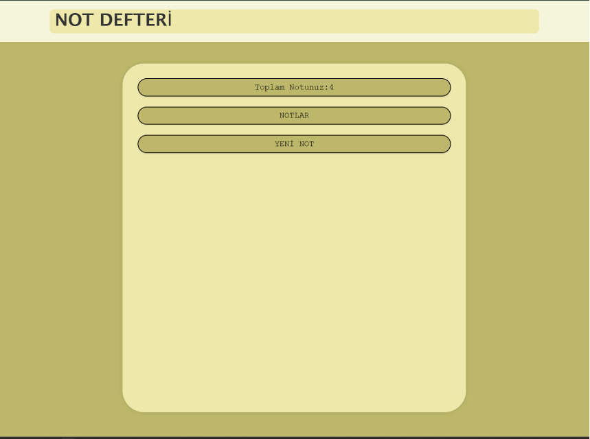
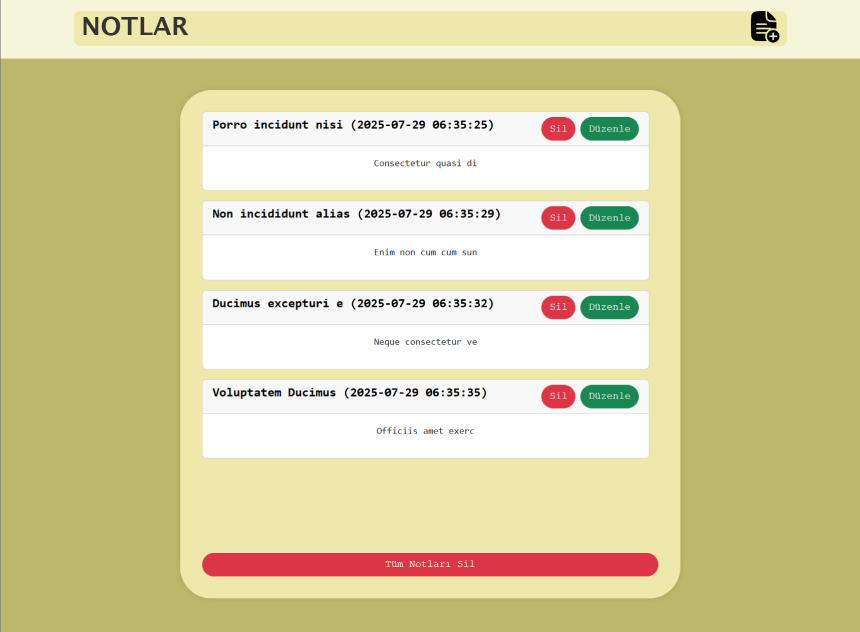
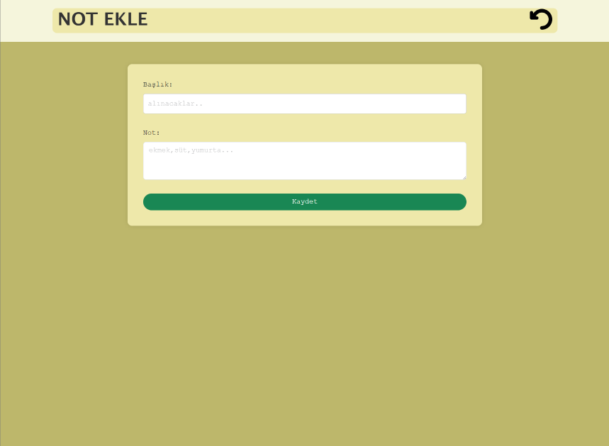
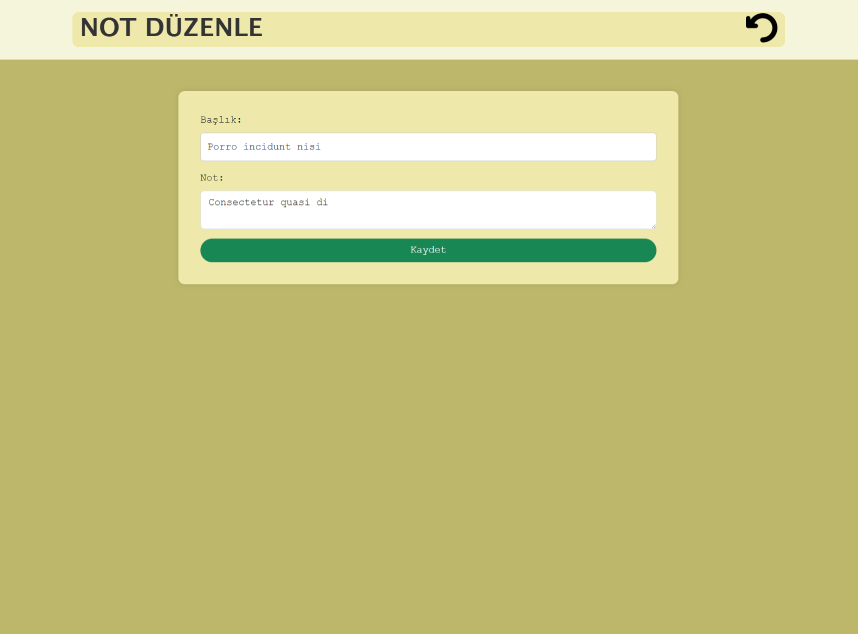

# NOT DEFTERİ
Kullanıcılar not ekleyebilir, silebilir, düzenleyebilir.

## Özellikler
Bu not defteri uygulaması, Slim Framework ve Smarty şablon motoru kullanılarak PHP ile geliştirilmiştir. Notlar, JSON dosyasında saklanmakta olup; ekleme, silme, düzenleme ve listeleme işlemleri desteklenmektedir. Her not, oluşturulma tarihi ve saatiyle birlikte kaydedilir. Arayüz tasarımı için Bootstrap 5 kullanılmıştır.

## Kullanılan Teknolojiler
- PHP
- Composer
- Smarty
- Slim
- HTML, CSS, JS
- Bootstrap
- GitHub

## Uygulama Görüntüleri

